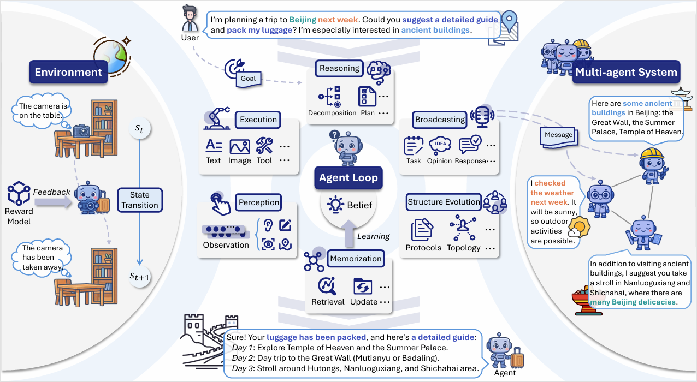

# Awesome-Agent-Hallucinations
Welcome to the **Awesome-Agent-Hallucinations** repository! This repository is a library of works related to **Large Language Models (LLMs) based Agent Hallucinations**. For a detailed introduction, please refer our survey paper:

:sparkles:**LLM-based Agents Suffer from Hallucinations: A Survey of Taxonomy, Methods, and Directions**:sparkles:

  

:star_struck:An overview of agent goal completion. 

* Within the loop, the LLM-based agent carries out external behaviors including reasoning, execution, perception, and memorization, guided by its internal belief state.
* Throughout this process, the environment dynamically evolves in response to the agent’s decisions, while task allocation within the LLM-based multi-agent system further enhances the fulfillment of user requirements.

## :star2:1 Reasoning Hallucinations
* **LLM+Map: Bimanual Robot Task Planning Using Large Language Models And Planning Domain Definition Language**  
* **Large language models for planning: A comprehensive and systematic survey** 
* **Plan-then-execute: An empirical study of user trust and team performance when using llm agents as a daily assistant** 

## :star2:2 Execution Hallucinations

## :star2:3 Perception Hallucinations

## :star2:4 Memorization Hallucinations

## :star2:5 Communication Hallucinations

